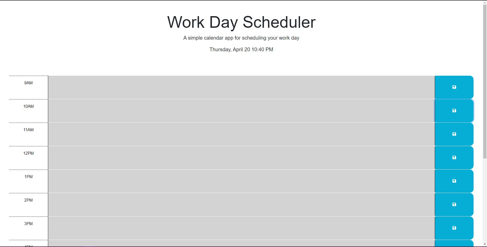

# < Work-Day Scheduler >

## Description
For this personal project I wanted to work in some JQuery and Dayjs into my code to create a simple work day scheduling app. This app will color code your day by the hour (between the hours of 9am & 9pm) as well as let you set tasks for the day, and save them upon reload! I hope this project will help the organizationally challenged (like myself) set themselves up for success!
## Usage

 Type in whatever you want to save into the buttons and press save! It will be there! To remove a notice, delete it from the button then save it again!

[Live site right here!](https://shadowasders.github.io/Code-Quiz/)

## Credits

I'd like to thank my instructor [Anthony Maddatu](https://github.com/amaddatu) For really helping me out when I got caught saving the text, without him this would have taken me much longer to figure out!

## License

